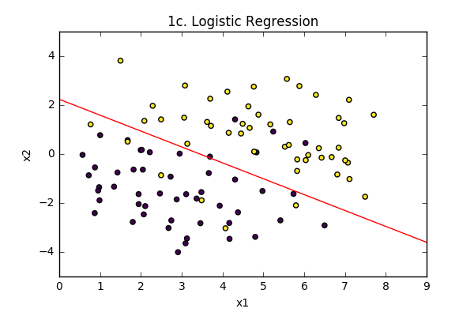
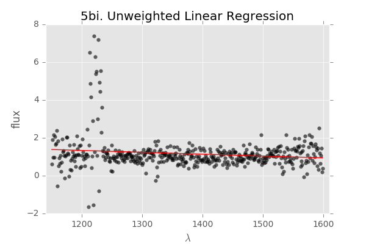
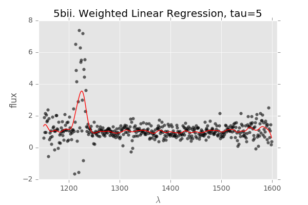
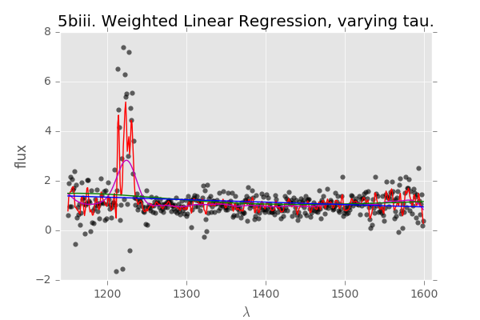
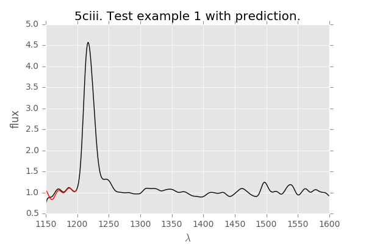
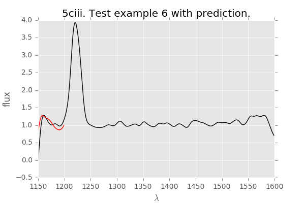

```{r setup, include=FALSE}
knitr::opts_chunk$set(echo = TRUE)
```

# **CS229 Autumn 2016 Problem Set #1**

### **1. Logistic Regression**

**a.** Consider the average empirical loss (the risk) for logistic regression:
$$
\begin{aligned}
J(\theta) & = \frac{1}{m} \sum_{i=1}^m \log \left(1+e^{-y^{(i)}\theta^Tx^{(i)}} \right) \\
          & = - \frac{1}{m} \sum_{i=1}^m \log \left(h_\theta \left(y^{(i)} x^{(i)} \right) \right) \\
          & &h_\theta(x) & = g(\theta^Tx), \\
          & &g(z) & = \frac{1}{1+e^{-z}}
\end{aligned}
$$
Find the Hessian $H$ of this function, and show that for any vector $z$, it holds true that
$$
z^THz \geq 0.
$$
*Hint:* You might want to start by showing the fact that $\sum_i \sum_j z_i x_i x_j z_j = \left(x^Tz \right)^2 \geq 0$.

**Remark:** This is one of the standard ways of showing that the matrix $H$ is positive semidefinite, written "$H \succeq 0$." This implies that $J$ is convex, and has no local minima other than the global one. If you have some other way of showing $H \succeq 0$, you're also welcome to use your method instead of the one above.

$$
\begin{aligned}
J(\theta)                                     & = \frac{1}{m} \sum_{i=1}^m \log \left(1+e^{-y^{(i)}\theta^Tx^{(i)}} \right) \\
\frac{\partial J(\theta)}{\partial \theta_k}  & = \frac{1}{m} \sum_{i=1}^m \frac{e^{-y^{(i)}\theta^Tx^{(i)}}}{1+e^{-y^{(i)}\theta^Tx^{(i)}}} \left(-y^{(i)} x_k^{(i)} \right) \\
\frac{\partial J(\theta)}{\partial \theta_k}  & = \frac{1}{m} \sum_{i=1}^m \frac{1}{1 + e^{y^{(i)}\theta^Tx^{(i)}}} \left(-y^{(i)} x_k^{(i)} \right) \\
\frac{\partial J(\theta)}{\partial \theta_k}  & = - \frac{1}{m} \sum_{i=1}^m h_\theta \left(-y^{(i)}x^{(i)} \right) \left(y^{(i)} x_k^{(i)} \right) \\
\frac{\partial^2 J(\theta)}{\partial \theta_\ell \partial \theta_k} & = - \frac{1}{m} \sum_{i=1}^m \frac{\partial}{\partial \theta_\ell} h_\theta \left(-y^{(i)}x^{(i)} \right) \left(y^{(i)} x_k^{(i)} \right) \\
\frac{\partial^2 J(\theta)}{\partial \theta_\ell \partial \theta_k} & = - \frac{1}{m} \sum_{i=1}^m h_\theta \left(-y^{(i)} x^{(i)} \right) \left(1-h_\theta \left(-y^{(i)}x^{(i)} \right) \right) \left(-y^{(i)}x_k^{(i)} \right) \left(-y^{(i)}x_\ell^{(i)} \right) \\
H_{kl} & = -\frac{1}{m} \sum_{i=1}^m h_\theta \left(x^{(i)} \right) \left(1- h_\theta \left(x^{(i)} \right) \right) x_\ell^{(i)} x_k^{(i)}  \hspace{3em} \text{Where did the }y^{(i)} \text{go?} \\
& \hspace{14.5em} y^{(i)} \in \{-1,1\} \text{, plus the fact that} \\
& \hspace{14.5em} f(x) = h_\theta(x) (1-h_\theta(x)) \text{ is an even function } (f(x) = f(-x)), \\
& \hspace{14.5em} \text{so the Hessian doesn't depend on the training label.}
\end{aligned}
$$
So, the full Hessian $H$:
$$
H = \frac{1}{m} \sum_{i=1}^m h\left(x^{(i)} \right) \left(1-h\left(x^{(i)}\right) \right) x^{(i)} x^{(i)T}
$$
To show that $H$ is positive semidefinite:
$$
\begin{aligned}
& \qquad z^T Hz \\
& = z^T \left( \frac{1}{m} \sum_{i=1}^m h\left(x^{(i)} \right) \left(1-h\left(x^{(i)}\right) \right) x^{(i)} x^{(i)T} \right) z \\
& = \frac{1}{m} \sum_{i=1}^m h\left(x^{(i)} \right) \left(1-h\left(x^{(i)}\right) \right) z^T x^{(i)}x^{(i)T}z \\
& = \frac{1}{m} \sum_{i=1}^m h\left(x^{(i)} \right) \left(1-h\left(x^{(i)}\right) \right) \left(z^T x^{(i)}\right)^2 \geq 0, & \text{ since } h\left(x^{(i)} \right) \left(1-h\left(x^{(i)}\right) \right) \in [0,1] \\
&& \text{and } \left(z^T x^{(i)}\right)^2 \geq 0
\end{aligned}
$$


**b.** We have provided two data files:

  - http://cs229.stanford.edu/ps/ps1/logistic_x.txt
  - http://cs229.stanford.edu/ps/ps1/logistic_y.txt

These files contain the inputs $\left(x^{(i)} \in \mathbb{R}^2 \right)$ and outputs $\left(y^{(i)} \in \left\{-1,1 \right\} \right)$, respectively, for a binary classification problem, with one training example per row. Implement Newton's method for optimizing $J(\theta)$, and apply it to fit a logistic regression model to the data. Initialize Newton's method with $\theta = \vec{0}$ (the vector of all zeros). What are the coefficients $\theta$ resulting from your fit? (Remember to include the intercept term.)

$$
\theta =  \begin{bmatrix}
          - 2.6205 \\
            0.7604 \\
            1.1719
          \end{bmatrix}
$$
See python notebook `ps1-1bc.ipynb`.

**c.** Plot the training data (your axes should be $x_1$ and $x_2$, corresponding to the two coordinates of the inputs, and you should use a different symbol for each point plotted to indicate whether that example has label $1$ or $-1$). Also plot on the same figure the decision boundary fit by logistic regression. (This should be a straight line showing the boundary separating the region where $h_\theta(x) > 0.5$ from where $h_\theta(x) \leq 0.5$.)

<center></center>

See python notebook `ps1-1bc.ipynb`.

### **2. Poisson regression and the exponential family**

**a.** Consider the Poisson distribution parameterized by $\lambda$:
$$
p(y; \lambda) = \frac{e^{-\lambda}\lambda^y}{y!}
$$
Show that the Poisson distribution is in the exponential family, and clearly state what $b(y)$, $\eta$, $T(y)$, and $a(\eta)$ are.

$$
\begin{aligned}
p(y; \lambda) & = \frac{e^{-\lambda}\lambda^y}{y!} \\
              & = \frac{1}{y!} e^{-\lambda} e^{y \log \lambda} \\
              & = \frac{1}{y!} \exp{\left(y \log \lambda - \lambda\right)} & \text{exp. form:}\quad b(y) \exp \left(\eta^T T(y) - a(\eta) \right) \\
              \\
          b(y) & = \frac{1}{y!} \\
          T(y) & = y \\
          \eta & = \log \lambda \\
          a(\eta) & = e^\eta
\end{aligned}
$$

**b.** Consider performing regression using a GLM model with a Poisson response variable. What is the canonical response function for the family? (You may use the fact that a Poisson random variable with parameter $\lambda$ has mean $\lambda$.)

$$
\begin{aligned}
g(\eta) & = \text{E}\left[y; \eta\right] \\
        & = \lambda \\
        & = e^\eta
\end{aligned}
$$

**c.** For a training set $\left\{x^{(i)}, y^{(i)}; i = 1, \dots, m \right\}$, let the log-likelihood of an example be $\log p \left(y^{(i)} | x^{(i)}; \theta \right)$. By taking the derivative of the log-likelihood w.r.t. $\theta_j$, derive the stochastic gradient ascent rule for learning using a GLM model with Poisson responses $y$ and the canonical response function.

$$
\begin{aligned}
p\left(y^{(i)} \mid x^{(i)}; \theta \right) & = \frac{1}{y^{(i)}!} \exp \left(\eta^T y^{(i)}-e^{\eta} \right) \\
                                            & = \frac{1}{y^{(i)}!} \exp \left(\left(\theta^Tx \right)^T y^{(i)}-e^{\theta^Tx} \right) \\
                              \ell(\theta)  & = \log \left[\frac{1}{y^{(i)}!} \exp \left(x^{(i)T}\theta y^{(i)}-e^{x^{(i)T}\theta} \right) \right] \\
                                            & = -\log \left(y^{(i)}! \right) + x^{(i)T}\theta y^{(i)}-e^{x^{(i)T}\theta} \\
                \nabla_\theta \ell(\theta)  & = x^{(i)T} y^{(i)} - x^{(i)T}e^{x^{(i)T}\theta} \\
                                            & =  \left(y^{(i)}-e^{\theta^Tx^{(i)}} \right) x^{(i)} \\
                                            \\
\therefore \frac{\partial \ell(\theta)}{\partial \theta_j} & = \left(y^{(i)}-e^{\theta^Tx^{(i)}} \right) x_j^{(i)}
\end{aligned}
$$

The stochastic gradient ascent update rule:
$$
\begin{aligned}
\theta & \gets \theta + \alpha \frac{\partial \ell (\theta)}{\partial \theta_j} \\
\theta & \gets \theta + \alpha \left(y^{(i)}-e^{\theta^Tx^{(i)}} \right) x_j^{(i)}
\end{aligned}
$$

**d.** Consider using a GLM with a response variable from any member of the exponential family in which $T(y) = y$, and the canonical response function $h(x)$ for the family. Show that stochastic gradient ascent on the log-likelihood $\log p(\vec{y} |X; \theta)$ results in the update rule $\theta_i \gets \theta_i - \alpha(h(x)-y)x_i$.


$$
\begin{aligned}
\ell (\theta) & = \log p(y \mid x ; \theta) \\
              & = \log \left[b(y) \exp \left(\eta^T T(y) - a(\eta) \right) \right] & \text{response variable in exponential family} \\
              & = \log \left[b(y) \exp \left(x \theta^Ty - a(\eta) \right) \right] & \eta = \theta^Tx,\hspace{.5em} T(y) = y \\
              & = \log \left[b(y) \right] + x \theta^T y - a(\eta) \\
\frac{\partial \ell (\theta)}{\partial \theta_j}  & = x_jy - \frac{\partial a(\eta)}{\partial \eta} \frac{\partial \eta}{\partial \theta_j} & \text{just the chain rule} \\
                                                  & = x_jy - \frac{\partial a(\eta)}{\partial \eta} \frac{\partial}{\partial \theta_j}\left(\theta^Tx \right) \\
                                                  & = x_jy - \frac{\partial a(\eta)}{\partial \eta} x_j \\
\frac{\partial \ell (\theta)}{\partial \theta_j}  & = \left(y- \frac{\partial a(\eta)}{\partial \eta} \right) x_j
\end{aligned}
$$


The stochastic gradient ascent update rule is then:
$$
\begin{aligned}
\theta_i & \gets \theta_i + \alpha \frac{\partial \ell (\theta)}{\partial \theta_j} \\
\theta_i & \gets \theta_i + \alpha \left(y- \frac{\partial a(\eta)}{\partial \eta} \right) x_j \\
\theta_i & \gets \theta_i - \alpha \left(\frac{\partial a(\eta)}{\partial \eta} -y \right) x_j & \text{versus } \theta_i & \gets \theta_i - \alpha \left(h(x)-y \right)
\end{aligned}
$$
The two update rules are equivalent if $\frac{\partial a(\eta)}{\partial \eta} = h(x)$. Start with the fact that  $\int_yp(y \mid x; \theta)dy = 1$, since it is a probability distribution.
$$
\begin{aligned}
\int_y p(y \mid x; \theta) dy & = 1 \\
\int_y b(y) \exp \left(\eta^Ty-a(\eta) \right) dy & = 1 \\
\int_y b(y) \exp \left(\eta^Ty \right) dy & = \exp \left(a(\eta) \right) \\
\frac{\partial}{\partial \eta} \int_y b(y) \exp \left(\eta^Ty \right) dy & = \frac{\partial}{\partial \eta} \exp \left(a(\eta) \right) \\
\int_y yb(y) \exp \left(\eta^Ty \right) dy & = \exp \left(a(\eta) \right) \frac{\partial a(\eta)}{\partial \eta} \\
\int_y yb(y) \exp \left(\eta^Ty - a(\eta)\right) dy & = \frac{\partial a(\eta)}{\partial \eta} \\
\int_y y \cdot p(y \mid x; \theta) dy & = \frac{\partial a(\eta)}{\partial \eta} \\
\text{E} \left[y \mid x; \theta \right]& = \frac{\partial a(\eta)}{\partial \eta} \\
h(x) & = \frac{\partial a(\eta)}{\partial \eta} \\
\\
\therefore \hspace{.5em} &  \theta_i \gets \theta_i - \alpha \left(h(x)-y \right)
\end{aligned}
$$

### **3. Gaussian discriminant analysis**
Suppose we are given a dataset $\left\{\left(x^{(i)}, y^{(i)} \right); i = 1, \dots, m \right\}$ consisting of $m$ independent examples, where $x^{(i)} \in \mathbb{R}^n$ are $n$-dimensional vectors, and $y^{(i)} \in \{-1,1\}$. We will model the joint distribution of $(x,y)$ according to:
$$
\begin{aligned}
p(y) & = \begin{cases}
          \phi & \text{if } y = 1 \\
          1-\phi & \text{if } y = -1
          \end{cases} \\
p(x \mid y=-1) & = \frac{1}{(2\pi)^{\frac{n}{2}} \lvert \Sigma \rvert^{\frac{1}{2}}} \exp \left(-\frac{1}{2} \left(x-\mu_{-1} \right)^T\Sigma^{-1} \left(x-\mu_{-1} \right) \right) \\
p(x \mid y=1)  & = \frac{1}{(2\pi)^{\frac{n}{2}} \lvert \Sigma \rvert^{\frac{1}{2}}} \exp \left(-\frac{1}{2} \left(x-\mu_{1} \right)^T\Sigma^{-1} \left(x-\mu_{1} \right) \right)
\end{aligned}
$$
Here, the parameters of our model are $\phi$, $\Sigma$, $\mu_{-1}$, $\mu_1$. (Note that while there are two different mean vectors $\mu_{-1}$ and $\mu_1$, there's only one covariance matrix $\Sigma$.)

**a.** Suppose we have already fit $\phi$, $\Sigma$, $\mu_{-1}$, $\mu_1$, and now want to make a prediction at some new query point $x$. Show that the posterior distribution of the label at $x$ takes the form of a logistic function, and can be written
$$
p(y \mid x; \phi, \Sigma, \mu_{-1}, \mu_{1}) = \frac{1}{1+\exp \left(-y(\theta^Tx + \theta_0) \right)},
$$
where $\theta \in \mathbb{R}^n$ and the bias term $\theta_0 \in \mathbb{R}$ are some appropriate functions of $\phi$, $\Sigma$, $\mu_{-1}$, $\mu_1$. (Note: the term $\theta_0$ corresponds to introducing an extra coordinate $x_0^{(i)}=1$.)

$$
\begin{aligned}
p(y=1 \mid x) & = \frac{p(x \mid y=1)p(y=1)}{p(x)} \\
              & = \frac{p(x \mid y=1)p(y=1)}{p(x \mid y=1)p(y=1)+ p(x \mid y=-1)p(y=-1)} \\
              & = \frac{\frac{1}{(2\pi)^{\frac{n}{2}} \lvert \Sigma \rvert^{\frac{1}{2}}} \exp \left(-\frac{1}{2} \left(x-\mu_{1} \right)^T\Sigma^{-1} \left(x-\mu_{1} \right) \right) \left(\phi \right)  }{ \frac{1}{(2\pi)^{\frac{n}{2}} \lvert \Sigma \rvert^{\frac{1}{2}}} \exp \left(-\frac{1}{2} \left(x-\mu_{1} \right)^T\Sigma^{-1} \left(x-\mu_{1} \right) \right) \left(\phi \right) + \frac{1}{(2\pi)^{\frac{n}{2}} \lvert \Sigma \rvert^{\frac{1}{2}}} \exp \left(-\frac{1}{2} \left(x-\mu_{-1} \right)^T\Sigma^{-1} \left(x-\mu_{-1} \right) \right)\left(1-\phi \right)} \\
              & = \frac{\phi \exp \left(-\frac{1}{2} \left(x-\mu_{1} \right)^T\Sigma^{-1} \left(x-\mu_{1} \right) \right) }{\phi \exp \left(-\frac{1}{2} \left(x-\mu_{1} \right)^T\Sigma^{-1} \left(x-\mu_{1} \right) \right)  +  \left(1-\phi \right) \exp \left(-\frac{1}{2} \left(x-\mu_{-1} \right)^T\Sigma^{-1} \left(x-\mu_{-1} \right) \right)} \\
              & = \frac{1}{1+\frac{\left(1-\phi \right)\exp \left(-\frac{1}{2} \left(x-\mu_{-1} \right)^T\Sigma^{-1} \left(x-\mu_{-1} \right) \right)}{\phi \exp \left(-\frac{1}{2} \left(x-\mu_{1} \right)^T\Sigma^{-1} \left(x-\mu_{1} \right) \right)}} \\
              & = \frac{1}{1+ \exp \left(\log\left(\frac{\left(1-\phi \right)}{\phi}\right) -\frac{1}{2} \left(x-\mu_{-1} \right)^T\Sigma^{-1} \left(x-\mu_{-1} \right) + \frac{1}{2} \left(x-\mu_{1} \right)^T\Sigma^{-1} \left(x-\mu_{1} \right) \right)} \\
              & = \frac{1}{1+\exp \left(\log \left(\frac{1-\phi}{\phi}\right) -\frac{1}{2} \left(x^T \Sigma^{-1}x -2x^T \Sigma^{-1}\mu_{-1}+ \mu_{-1}^T \Sigma^{-1} \mu_{-1}\right) + \frac{1}{2} \left(x^T \Sigma^{-1}x -2x^T \Sigma^{-1}\mu_{1}+ \mu_{1}^T \Sigma^{-1} \mu_{1} \right)\right)} \\
              & = \frac{1}{1+\exp \left(\log \left(\frac{1-\phi}{\phi}\right) + x^T \Sigma^{-1} \mu_{-1} - x^T \Sigma^{-1} \mu_1 - \frac{1}{2} \mu_{-1}^T \Sigma^{-1} \mu_{-1} + \frac{1}{2} \mu_1^T\Sigma^{-1}\mu_1 \right)} \\
              & = \frac{1}{1+ \exp\left(\log\left(\frac{1-\phi}{\phi}\right) + x^T \Sigma^{-1} \left(\mu_{-1}-\mu_1 \right) - \frac{1}{2}\mu_{-1}^T\Sigma^{-1}\mu_{-1} + \mu_1^T \Sigma^{-1} \mu_1 \right)} \\
              \\
              \text{Let } \theta = \Sigma^{-1}\left(\mu_{1}-\mu_{-1} \right) &, \qquad \theta_0 = \frac{1}{2}\left(\mu_{-1}^T \Sigma^{-1} \mu_{-1}- \mu_1^T \Sigma^{-1}\mu_1 \right). \text{ Then,} \\
        p(y=1 \mid x) & = \frac{1}{1+\exp \left(-y(\theta^Tx + \theta_0) \right)}
\end{aligned}
$$

**b.** For this part of the problem only, you may assume $n$ (the dimension of $x$) is $1$, so that $\Sigma = [\sigma^2]$ is just a real number, and likewise the determinant of $\Sigma$ is given by $\lvert \Sigma\rvert = \sigma^2$. Given the dataset, we claim that the maximum likelihood estimates of the parameters are given by
$$
\begin{aligned}
\phi      & = \frac{1}{m} \sum_{i=1}^m 1 \left\{y^{(i)}=1 \right\} \\
\mu_{-1}  & = \frac{\sum_{i=1}^m 1\left\{y^{(i)}=-1 \right\}x^{(i)}}{\sum_{i=1}^m 1\left\{y^{(i)}=-1\right\}} \\
\mu_{1}   & = \frac{\sum_{i=1}^m 1\left\{y^{(i)}=1 \right\}x^{(i)}}{\sum_{i=1}^m 1\left\{y^{(i)}=1\right\}} \\
\Sigma    & = \frac{1}{m} \sum_{i=1}^m \left(x^{(i)}-\mu_{y^{(i)}} \right) \left(x^{(i)}-\mu_{y^{(i)}} \right)^T
\end{aligned}
$$

The log-likelihood of the data is
$$
\begin{aligned}
\ell \left(\phi, \mu_{-1}, \mu_1, \Sigma \right)  & = \log \prod_{i=1}^m p(x^{(i)}, y^{(i)}; \phi, \mu_{-1}, \mu_1, \Sigma) \\
                                                  & = \log \prod_{i=1}^m p(x^{(i)}\mid y^{(i)}; \phi, \mu_{-1}, \mu_1, \Sigma)p(y^{(i)};\phi).
\end{aligned}
$$

By maximizing $\ell$ w.r.t. the four parameters, prove that the maximum likelihood estimates of $\phi$, $\mu_{-1}$, $\mu_1$, and $\Sigma$ are indeed as given in the formulas above. (You may assume that there is at least one positive and one negative example, so that the denominators in the definition of $\mu_{-1}$ and $\mu_1$ above are non-zero.)

See problem 3c.

**c.** Without assuming that $n=1$, show that the maximum likelihood estimates of $\phi$, $\mu_{-1}$, $\mu_1$, and $\Sigma$ are as given in the formulas in part (b). [Note: If you're fairly sure that you have the answer to this part right, you don't have to do part (b), since that's just a special case.]

$$
\begin{aligned}
\ell \left(\phi, \mu_{-1}, \mu_1, \Sigma \right)  & = \log \prod_{i=1}^m p(x^{(i)}\mid y^{(i)}; \phi, \mu_{-1}, \mu_1, \Sigma)p(y^{(i)};\phi) \\
                                                  & = \sum_{i=1}^m \log p(x^{(i)}\mid y^{(i)}; \phi, \mu_{-1}, \mu_1, \Sigma) + \sum_{i=1}^m \log p(y^{(i)};\phi) \\
                                                  & = \sum_{i=1}^m \left[\log \frac{1}{\left(2 \pi \right)^{\frac{n}{2}} \lvert \Sigma \rvert^{\frac{1}{2}}} - \frac{1}{2} \left(x^{(i)} - \mu_{y^{(i)}}  \right)^T \Sigma^{-1} \left(x^{(i)} - \mu_{y^{(i)}}  \right) + \log \phi^{y^{(i)}} + \log \left(1- \phi \right)^{\left(1-y^{(i)} \right)} \right] \\
                                                  & = \sum_{i=1}^m \left[- \frac{n}{2} \log \left(2 \pi \right) - \frac{1}{2} \log \lvert \Sigma \rvert - \frac{1}{2} \left(x^{(i)} - \mu_{y^{(i)}}  \right)^T \Sigma^{-1} \left(x^{(i)} - \mu_{y^{(i)}}  \right) + y^{(i)} \log \phi + \left(1-y^{(i)} \right) \log \left(1- \phi \right) \right] \\
                                                  & \hspace{7em} - \frac{n}{2} \log \left(2 \pi \right)\text{ is constant w.r.t. the parameters, so can be dropped for finding MLE.} \\
                                                  & \simeq \sum_{i=1}^m \left[- \frac{1}{2} \log \lvert \Sigma \rvert - \frac{1}{2} \left(x^{(i)} - \mu_{y^{(i)}}  \right)^T \Sigma^{-1} \left(x^{(i)} - \mu_{y^{(i)}}  \right) + y^{(i)} \log \phi + \left(1-y^{(i)} \right) \log \left(1- \phi \right) \right] \\
\end{aligned}
$$

$$
\begin{aligned}                                                  \\
\nabla_\phi \ell \left(\phi, \mu_{-1}, \mu_1, \Sigma \right)  & = \sum_{i=1}^m \left[\frac{y^{(i)}}{\phi} - \frac{1-y^{(i)}}{1-\phi} \right] \\
                                                              &   \text{Note: why does} \sum_{i=1}^m y^{(i)} = \sum_{i=1}^m 1 \left\{y^{(i)}=1 \right\}...?\\
                                                              & = \frac{\sum_{i=1}^m 1\left\{y^{(i)}=1 \right\}}{\phi} - \frac{m- \sum_{i=1}^m 1\left\{y^{(i)}=1 \right\}}{1-\phi} = 0 \hspace{5em}\text{ let } A = \sum_{i=1}^m 1 \left\{y^{(i)}=1 \right\}  \\
\frac{A}{\phi}                                                & = \frac{m-A}{1-\phi} \\
A - \phi A                                                    & = \phi m - \phi A \\
A                                                             & = \phi m \\
\phi                                                          & = \frac{A}{m} \\
\phi                                                          & = \frac{1}{m}\sum_{i=1}^m 1 \left\{y^{(i)}=1 \right\}
\end{aligned}
$$
$$
\begin{aligned}
\nabla_{\mu_{-1}} \ell \left(\phi, \mu_{-1}, \mu_1, \Sigma \right)  & = - \frac{1}{2} \sum_{i : y^{(i)}=-1} \nabla_{\mu_{-1}} \left[ -2 \mu_{-1}^T \Sigma^{-1} x^{(i)} + \mu_{-1}^T \Sigma^{-1} \mu_{-1}  \right] \hspace{8em} x^{(i)T} \Sigma x^{(i)} \text{ is dropped as it isn't a function of }\mu_{-1} \\
                                                                    & = - \frac{1}{2} \sum_{i : y^{(i)}=-1} \left[-2 \Sigma^{-1}x^{(i)} + 2  \Sigma^{-1} \mu_{-1} \right] = 0\\
                                                                  0 & = \sum_{i:y(i)=-1} \left[\Sigma^{-1}x^{(i)}-\Sigma^{-1} \mu_{-1} \right] \\
                                                                  0 & = \sum_{i=1}^m 1 \left\{y^{(i)}=-1\right\} \Sigma^{-1} x^{(i)} - \sum_{i=1}^m 1 \left\{y^{(i)}=-1 \right\} \Sigma^{-1} \mu_{-1} \\
\Sigma^{-1} \mu_{-1} \sum_{i=1}^m 1 \left\{y^{(i)}=-1 \right\}      & = \Sigma^{-1} \sum_{i=1}^m 1 \left\{y^{(i)}=-1\right\}  x^{(i)} \\
\mu_{-1}                                                            & = \frac{\sum_{i=1}^m 1 \left\{y^{(i)}=-1\right\}  x^{(i)}}{\sum_{i=1}^m 1 \left\{y^{(i)}=-1 \right\}}
\hspace{5em}
\text{similarly, } \mu_{1}                                           = \frac{\sum_{i=1}^m 1 \left\{y^{(i)}=1\right\}  x^{(i)}}{\sum_{i=1}^m 1 \left\{y^{(i)}=1 \right\}}
\end{aligned}
$$
Let $S = \Sigma^{-1}$. The maximum likelihood estimate of $S$ is equivalent to the MLE of $\Sigma$.
$$
\begin{aligned}
\nabla_{S} \ell \left(\phi, \mu_{-1}, \mu_1, \Sigma \right)  & = - \frac{1}{2}\sum_{i=1}^m \nabla_{\Sigma} \left[-\log \lvert S \rvert + \left(x^{(i)}- \mu_{y^{(i)}} \right)^T S \left(x^{(i)}- \mu_{y^{(i)}} \right) \right] \\
                                                                  & = - \frac{1}{2}\sum_{i=1}^m \left[-S^{-1} + \left(x^{(i)}- \mu_{y^{(i)}} \right)\left(x^{(i)}- \mu_{y^{(i)}} \right)^T \right] \\
                                                                  & = \sum_{i=1}^m \frac{1}{2} \Sigma - \frac{1}{2} \sum_{i=1}^m \left(x^{(i)}- \mu_{y^{(i)}} \right)\left(x^{(i)}- \mu_{y^{(i)}} \right)^T = 0 \\
\frac{1}{2} m \Sigma                                              & = \frac{1}{2} \sum_{i=1}^m \left(x^{(i)}- \mu_{y^{(i)}} \right)\left(x^{(i)}- \mu_{y^{(i)}} \right)^T \\
\Sigma                                                            & = \frac{1}{m}\sum_{i=1}^m \left(x^{(i)}- \mu_{y^{(i)}} \right)\left(x^{(i)}- \mu_{y^{(i)}} \right)^T
\end{aligned}
$$


### **4. Linear invariance of optimization algorithms**
Consider using an iterative optimization algorithm (such as Newton's method, or gradient descent) to minimize some continuously differentiable function $f(x)$. Suppose we initialize the algorithm at $x^{(0)} = \vec{0}$. when the algorithm is run, it will produce a value of $x \in \mathbb{R}^n$ for each iteration: $x^{(1)}, x^{(2)}, \dots$.

Now, let some non-singular square matrix $A \in \mathbb{R}^{n \times n}$ be given, and define a new function $g(z) = f(Az)$. Consider using the same iterative optimization algorithm to optimize $g$ (with initialization $z^{(0)} = \vec{0}$). If the values $z^{(1)}, z^{(2)}, \dots$ produced by this method necessarily satisfy $z^{(i)} = A^{-1}x^{(i)}$ for all $i$, we say this optimization algorithm is ***invariant to linear reparameterizations***.

**a.** Show that Newton's method (applied to find the minimum of a function) is invariant to linear reparameterizations. Note that since $z^{(0)} = \vec{0} = A^{-1}x^{(0)}$, it is sufficient to show that if Newton's method applied to $f(x)$ updates $x^{(i)}$ to $x^{(i+1)}$, then Newton's method applied to $g(z)$ will update $z^{(i)} = A^{-1}x^{(i)}$ to $z^{(i+1)} = A^{-1}x^{(i+1)}$.

For Newton's method, need the gradient $\nabla_z g(z)$ and the Hessian $\nabla_z^2 g(z)$. Start with the gradient. I got confused as hell without keeping track of the dimensions of everything:
$$
\begin{aligned}
\nabla_z g(z) & \in \mathbb{R}^{n} & \text{gradient wrt } z \in \mathbb{R}^n \text{ is also } \in \mathbb{R}^n \\
\frac{\partial g}{\partial z_i} & \in \mathbb{R} & \text{each component of } \nabla_z g(z) \text{ is} \in \mathbb{R}\\
\frac{\partial f(Az)}{\partial(Az)} & \in \mathbb{R}^{n} & \text{derivative of } f \in \mathbb{R} \text{ wrt } Az \in \mathbb{R}^{n}\\
\frac{\partial (Az)}{\partial z_i} & \in \mathbb{R}^{n} & \text{derivative of }Az \in \mathbb{R}^n \text{ wrt } z_i \in \mathbb{R}
\end{aligned}
$$
$$
\begin{aligned}
\nabla_z g(z)  = \begin{bmatrix}
                  \frac{\partial g(z)}{\partial z_1} \\ \frac{\partial g(z)}{\partial z_2} \\ \vdots \\ \frac{\partial g(z)}{\partial z_n}
                  \end{bmatrix}
              &  = \begin{bmatrix}
                  \left[ \frac{\partial (Az)}{\partial z_1} \right]^T  \left[ \frac{\partial f(Az)}{\partial \left(Az\right)} \right]\\
                  \left[ \frac{\partial (Az)}{\partial z_2} \right]^T  \left[ \frac{\partial f(Az)}{\partial \left(Az\right)} \right]\\
                  \vdots \\
                  \left[ \frac{\partial (Az)}{\partial z_n} \right]^T  \left[ \frac{\partial f(Az)}{\partial \left(Az\right)} \right]\\
                  \end{bmatrix} \hspace{2em} \text{by the chain rule}\\
              & = \begin{bmatrix}
                  \begin{bmatrix} - & a_1^T & - \end{bmatrix} \left[ \frac{\partial f(Az)}{\partial \left(Az\right)} \right]  \\
                  \begin{bmatrix} - & a_2^T & - \end{bmatrix} \left[ \frac{\partial f(Az)}{\partial \left(Az\right)} \right]  \\
                  \vdots \\
                  \begin{bmatrix} - & a_n^T & - \end{bmatrix} \left[ \frac{\partial f(Az)}{\partial \left(Az\right)} \right]  \\
                  \end{bmatrix}
               = \begin{bmatrix}
                  - & a_1^T & - \\
                  - & a_2^T & - \\
                    & \vdots&   \\
                  - & a_n^T & - \\
                  \end{bmatrix}
                  \left[ \frac{\partial f(Az)}{\partial \left(Az\right)} \right]
               = A^T \nabla_x f(Az), \\
               \\
              & \text{where the fact that } \frac{\partial(Az)}{\partial z_i} = a_i \text{ (the } i\text{-th column of A) by:} \\
Az            & = \begin{bmatrix} \mid \\ a_1 \\ \mid \end{bmatrix} z_1 + \begin{bmatrix} \mid \\ a_2 \\ \mid \end{bmatrix} z_2 + \dots + \begin{bmatrix} \mid \\ a_n \\ \mid \end{bmatrix} z_n \\
\frac{\partial}{\partial z_i} Az& = \begin{bmatrix} \mid \\ a_i \\ \mid \end{bmatrix}
\end{aligned}
$$
Now for the Hessian, starting again with the dimensions of everything in order to be slightly less confused:
$$
\begin{aligned}
\nabla_z^2 g(z)   & \in \mathbb{R}^{n \times n} & \text{Hessian wrt }z \in \mathbb{R}^n \\
(\nabla_z g(z))_i & \in \mathbb{R}              & i\text{-th component of the gradient is} \in \mathbb{R} \\
\nabla_z (\nabla_z g(z))_i & \in \mathbb{R}^n   & \text{gradient wrt }z \in \mathbb{R}^n
\end{aligned}
$$

<!--
$$
\begin{aligned}
\nabla_z^2 g(z) & = \begin{bmatrix} \nabla_z \left(\nabla_z g(z) \right)_1 & \nabla_z \left(\nabla_z g(z) \right)_2 & \cdots & \nabla_z \left(\nabla_z g(z) \right)_n \end{bmatrix} \\
                & = \begin{bmatrix} \nabla_z \left( a_1^T \nabla_x f(Az) \right) & \nabla_z \left( a_2^T \nabla_x f(Az) \right) & \cdots & \nabla_z \left( a_n^T \nabla_x f(Az) \right) \end{bmatrix} \\
                & = \begin{bmatrix}
                    \frac{\partial}{\partial z_1} a_1^T \frac{\partial f (Az)}{\partial (Az)} & \frac{\partial}{\partial z_1} a_2^T \frac{\partial f (Az)}{\partial (Az)} & \cdots & \frac{\partial}{\partial z_1} a_n^T \frac{\partial f (Az)}{\partial (Az)} \\
                    \frac{\partial}{\partial z_2} a_1^T \frac{\partial f (Az)}{\partial (Az)} & \frac{\partial}{\partial z_2} a_2^T \frac{\partial f (Az)}{\partial (Az)} & \cdots & \frac{\partial}{\partial z_2} a_n^T \frac{\partial f (Az)}{\partial (Az)} \\
                    \vdots & \vdots & \ddots & \vdots \\
                    \frac{\partial}{\partial z_n} a_1^T \frac{\partial f (Az)}{\partial (Az)} & \frac{\partial}{\partial z_n} a_2^T \frac{\partial f (Az)}{\partial (Az)} & \cdots & \frac{\partial}{\partial z_n} a_n^T \frac{\partial f (Az)}{\partial (Az)}
                    \end{bmatrix} \\
                & =
\end{aligned}
$$
-->


$$
\begin{aligned}
\nabla_z^2 g(z) & = \begin{bmatrix}
                    \frac{\partial^2 g(z)}{\partial z_1^2} & \frac{\partial^2 g(z)}{\partial z_1 \partial z_2} & \cdots & \frac{\partial^2 g(z)}{\partial z_1 \partial z_n} \\
                    \frac{\partial^2 g(z)}{\partial z_2 \partial z_1} & \frac{\partial^2 g(z)}{\partial z_2^2} & \cdots & \frac{\partial^2 g(z)}{\partial z_2 \partial z_n} \\
                    \vdots & \vdots & \ddots & \vdots \\
                    \frac{\partial^2 g(z)}{\partial z_n \partial z_1} & \frac{\partial^2 g(z)}{\partial z_n \partial z_2} & \cdots & \frac{\partial^2 g(z)}{\partial z_n^2}
                    \end{bmatrix} \\
                & = \begin{bmatrix}
                    \frac{\partial^2 f(Az)}{\partial (Az)^2} \frac{\partial(Az)}{\partial z_1} \frac{\partial (Az)}{\partial z_1} & \frac{\partial^2 f(Az)}{\partial (Az)^2} \frac{\partial(Az)}{\partial z_1} \frac{\partial (Az)}{\partial z_2} & \cdots & \frac{\partial^2 f(Az)}{\partial (Az)^2} \frac{\partial(Az)}{\partial z_1} \frac{\partial (Az)}{\partial z_n} \\
                    \frac{\partial^2 f(Az)}{\partial (Az)^2} \frac{\partial(Az)}{\partial z_2} \frac{\partial (Az)}{\partial z_1} & \frac{\partial^2 f(Az)}{\partial (Az)^2} \frac{\partial(Az)}{\partial z_2} \frac{\partial (Az)}{\partial z_2} & \cdots & \frac{\partial^2 f(Az)}{\partial (Az)^2} \frac{\partial(Az)}{\partial z_2} \frac{\partial (Az)}{\partial z_n} \\
                    \vdots & \vdots & \ddots & \vdots \\
                    \frac{\partial^2 f(Az)}{\partial (Az)^2} \frac{\partial(Az)}{\partial z_n} \frac{\partial (Az)}{\partial z_1} & \frac{\partial^2 f(Az)}{\partial (Az)^2} \frac{\partial(Az)}{\partial z_n} \frac{\partial (Az)}{\partial z_2} & \cdots & \frac{\partial^2 f(Az)}{\partial (Az)^2} \frac{\partial(Az)}{\partial z_n} \frac{\partial (Az)}{\partial z_n}
                    \end{bmatrix} \hspace{2em} \text{chain rule -- is this legit?}\\
                & = \begin{bmatrix}
                    - & a_1^T & - \\
                    - & a_2^T & - \\
                      & \vdots &  \\
                    - & a_n^T & - \\
                    \end{bmatrix}
                    \begin{bmatrix}
                    \frac{\partial^2 f(x)}{\partial x_1^2} & \frac{\partial^2 f(x)}{\partial x_1 \partial x_2} & \cdots  & \frac{\partial^2 f(x)}{\partial x_1 \partial x_n} \\
                    \frac{\partial^2 f(x)}{\partial x_2 \partial x_1} & \frac{\partial^2 f(x)}{\partial x_2^2} & \cdots  & \frac{\partial^2 f(x)}{\partial x_2 \partial x_n} \\
                    \vdots  & \vdots  & \ddots  & \vdots  \\
                    \frac{\partial^2 f(x)}{\partial x_n \partial x_1} & \frac{\partial^2 f(x)}{\partial x_n \partial x_2} & \cdots  & \frac{\partial^2 f(x)}{\partial x_n^2}
                    \end{bmatrix}
                    \begin{bmatrix}
                    \mid  & \mid  &         & \mid  \\
                    a_1   & a_2   & \cdots  & a_3   \\
                    \mid  & \mid  &         & \mid
                    \end{bmatrix} \\
                & = A^T \left[ \nabla_x^2 f(x) \right] A
\end{aligned}
$$

So, the update rule for Newton's method:

$$
\begin{aligned}
z^{(i+1)} & = z^{(i)} - H_g \left(z^{(i)} \right)^{-1} \nabla_z g(z^{(i)}) \\
          & = z^{(i)} - \left(A^T H_f \left(Az^{(i)} \right)A \right)^{-1} A^T \nabla_x f \left(Az^{(i)} \right) \\
          & = z^{(i)} - A^{-1} H_f \left(Az^{(i)} \right)^{-1} \left(A^T \right)^{-1} A^T \nabla_x f \left(Az^{(i)} \right) \\
          & = z^{(i)} - A^{-1} H_f \left(Az^{(i)} \right)^{-1} \nabla_x f \left(Az^{(i)} \right)
\end{aligned}
$$

$$
\begin{aligned}
Az^{(i+1)}  & = A \left(z^{(i)} - A^{-1} H_f \left(Az^{(i)} \right)^{-1} \nabla_x f \left(Az^{(i)} \right) \right) \\
            & = Az^{(i)} - H_f \left(Az^{(i)} \right)^{-1} \nabla_x f \left(Az^{(i)} \right) \\
            & = x^{(i)} - H_f \left(x^{(i)} \right)^{-1} \nabla_x f \left(Az^{(i)} \right) \\
            & = x^{(i + 1)}
\end{aligned}
$$

**b.** Is gradient descent invariant to linear reparameterizations? Justify your answer.
The update rule:
$$
\begin{aligned}
z^{(i + 1)}   & = z^{(i)} - \alpha A^T \nabla_x f \left(Az^{(i)} \right) \\
Az^{(i + 1)}  & = Az^{(i)}  - \alpha A A^T \nabla_x f \left(Az^{(i)} \right) \\
              & = x^{(i)} - \alpha A A^T \nabla_x f \left(Az^{(i)} \right) \quad \text{vs.} \quad x^{(i+1)} = x^{(i)} - \alpha \nabla_x f \left(x^{(i)} \right)
              \\
              \therefore & \text{, gradient descent is invariant to linear reparameterizations only if} \\
              & \qquad AA^T = I \text{, i.e. if }A \text{ is an orthogonal matrix.}
\end{aligned}
$$

### **5. Regression for denoising quasar spectra**
**Introduction**. In this problem, we will apply a supervised learning technique to estimate the light spectrum of *quasars*. Quasars are luminous distant galactic nuclei that are so bright, their light overwhelms that of stars in their galaxies. Understanding properties of the spectrum of light emitted by a quasar is useful for a number of tasks: first, a number of quasar properties can be estimated from the spectra, and second, properties of the regions of the universe through which the light passes can also be evaluated (for example, we can estimate the density of neutral and ionized particles in the universe, which helps cosmologists understand the evolution and fundamental laws governing its structure). The *light spectrum* is a curve that relates the light’s intensity (formally, lumens per square meter), or luminous flux, to its wavelength. Figure 1 shows an example of a quasar light spectrum, where the wavelengths are measured in Angstroms ($\overset{\circ}{A}$), where $1 \overset{\circ}{A} = 10^{-10}$ meters.

The Lyman-$\alpha$ wavelength is a wavelength beyond which intervening particles at most negligibly interfere with light emitted from the quasar. (Interference generally occurs when a photon is absorbed by a neutral hydrogen atom, which only occurs for certain wavelengths of light.) For wavelengths greater than this Lyman-$\alpha$ wavelength, the observed light spectrum $f_{\text{obs}}$ can be modeled as a smooth spectrum $f$ plus noise:
$$
f_{\text{obs}}(\lambda) = f(\lambda) = \text{noise}(\lambda)
$$
For wavelengths below the Lyman-$\alpha$ wavelength, a region of the spectrum known as the Lyman-$\alpha$ forest, intervening matter causes attenuation of the observed signal. As light emitted by the quasar travels through regions of the universe richer in neutral hydrogen, some of it is absorbed, which we model as
$$
f_{\text{obs}}(\lambda) = \text{absorption}(\lambda) \cdot f(\lambda) + \text{noise}(\lambda)
$$
Astrophysicists and cosmologists wish to understand the absorption function, which gives information about the Lyman-$\alpha$ forest, and hence the distribution of neutral hydrogen in otherwise unreachable regions of the universe. This gives clues toward the formation and evolution of the universe. Thus, it is our goal to estimate the spectrum $f$ of an observed quasar.

**Getting the data**. We will be using data generated from the Hubble Space Telescope Faint Object Spectrograph (HST-FOS), Spectra of Active Galactic Nuclei and Quasars. We have provided two comma-separated data files located at:

  - Training set: `http://cs229.stanford.edu/ps/ps1/quasar_train.csv`
  - Test set: `http://cs229.stanford.edu/ps/ps1/quasar_test.csv`

Each file contains a single header row containing 450 numbers corresponding integral wavelengths in the interval $[1150; 1600] \overset{\circ}{A}$. The remaining lines contain relative flux measurements for each wavelength. Specifically, `quasar_train.csv` contains 200 examples and `quasar_test.csv` contains 50 examples. You may use the helper file `load_quasar_data.m` to load the data in Matlab: `http://cs229.stanford.edu/ps/ps1/load_quasar_data.m`

**a.** Locally weighted linear regression

  Consider a linear regression problem in which we want to "weight" different training examples differently. Specifically, suppose we want to minimize
  $$
  J(\theta) = \frac{1}{2} \sum_{i=1}^m w^{(i)} \left(\theta^Tx^{(i)}-y^{(i)} \right)^2
  $$
  In class, we worked out what happens for the case where all the weights $w^{(i)}$ are the same. In this problem, we will generalize some of those ideas to the weighted setting.

**i.** Show that $J(\theta)$ can also be written
  $$
  J(\theta) = \left(X \theta - \vec{y} \right)^T W \left(X \theta - \vec{y} \right)
  $$
  for an appropriate diagonal matrix $W$, and where $X$ and $\vec{y}$ are as defined in class. State clearly what $W$ is.

  $W \in \mathbb{R}^{n \times n}$ is a diagonal matrix, with $W_{ii} = \frac{1}{2}w^{(i)}$.

**ii.** If all the $w^{(i)}$'s equal $1$, then we saw in class that the normal equation is
  $$
  X^TX\theta = X^T \vec{y},
  $$
  and that the value of $\theta$ that minimizes $J(\theta)$ is given by $\left(X^T X \right)^{-1}X^T \vec{y}$. By finding the derivative $\nabla_\theta J(\theta)$ and setting that to zero, generalize the normal equation to this weighted setting, and give the new value of $\theta$ that minimizes $J(\theta)$ in closed form as a function of $X$, $W$, and $\vec{y}$.

  $$
  \begin{aligned}
  J(\theta)       & = \left(X \theta -y \right)^T W \left(X \theta -y \right) \\
  \nabla_\theta   & = \nabla_\theta \left[\left(X \theta \right)^TWX\theta - \left(X \theta \right)^T W y - y^T W X \theta + y^TWy\right] \\
                  & = \nabla_\theta \left[\theta^T X^T W X \theta -\theta^T X^T W y - y^T W X \theta \right] & \text{right two terms are equal scalars}\\
                  & = \nabla_\theta \left[\theta^T X^T W X \theta - 2X^T W y \right] \\
                  & = 2 X^T W X \theta - 2X^TWy =0 & \text{normal equation (weighted)} \\
  X^T W X \theta  & =  X^TWy \\
          \theta  & = \left(X^T W X \right)^{-1} X^TWy
  \end{aligned}
  $$

**iii.** Suppose we have a training set $\left\{x^{(i)}, y^{(i)}; i=1, \dots, m \right\}$ of $m$ independent examples, but in which the $y^{(i)}$'s were observed with differing variances. Specifically, suppose that
$$
p\left(y^{(i)} \mid x^{(i)}; \theta \right) = \frac{1}{\sqrt{2\pi}\sigma^{(i)}} \exp \left(- \frac{\left(y^{(i)}-\theta^Tx^{(i)} \right)^2}{2 \left(\sigma^{(i)} \right)^2} \right)
$$
I.e., $y^{(i)}$ has mean $\theta^T x^{(i)}$ and variance $\left(\sigma^{(i)} \right)^2$ (where the $\sigma^{(i)}$'s are fixed, known, constants). Show that finding the maximum likelihood estimate of $\theta$ reduces to solving a weighted linear regression problem. State clearly what the $w^{(i)}$'s are in terms of the $\sigma^{(i)}$'s.

$$
\begin{aligned}
\arg \max_\theta L (\theta) & = \arg \max_\theta \prod_{i=1}^m p \left(y^{(i)} \mid x^{(i)}; \theta \right) \\
                            & = \arg \max_\theta \prod_{i=1}^m \frac{1}{\sqrt{2 \pi} \sigma^{(i)}} \exp \left(- \frac{ \left(y^{(i)}-\theta^T x^{(i)} \right)^2}{2 \left(\sigma^{(i)} \right)^2} \right) \\
                            & = \arg \max_\theta- \frac{1}{2}\sum_{i=1}^m \frac{1}{\left(\sigma^{(i)} \right)^2} \left(y^{(i)}-\theta^T x^{(i)} \right)^2 \\
                            & = \arg \min_\theta \frac{1}{2} \sum_{i=1}^m w^{(i)} \left(y^{(i)}-\theta^T x^{(i)} \right)^2 \\
\therefore \arg \max_\theta L(\theta) & = \arg \min_\theta J(\theta) \hspace{5em} \text{where } w^{(i)} = \frac{1}{\left(\sigma^{(i)} \right)^2}
\end{aligned}
$$
Maximizing the log-likelihood $\ell(\theta)$ w.r.t. $\theta$ amounts to minimizing the right term. Comparing this term with the loss function for weighted linear regression:
$$
\begin{aligned}
\text{max likelihood} & \text{ vs. loss function} \\
\frac{1}{2}\sum_{i=1}^m \frac{1}{\left(\sigma^{(i)} \right)^2} \left(\theta^Tx^{(i)}- y^{(i)}\right)^2 & \text{ vs. } \frac{1}{2} \sum_{i=1}^m w^{(i)} \left(\theta^Tx^{(i)}- y^{(i)} \right)^2 \\
\therefore \text{finding the MLE estimate of } &\theta \text{ is equivalent to solving weighted linear regression, where} \\
w^{(i)} & = \frac{1}{\left( \sigma^{(i)}\right)^2}
\end{aligned}
$$

**b.** Visualizing the data

  **i.** Use the normal equations to implement (unweighted) linear regression ($y = \theta^Tx$) on the *first* training example (i.e. first non-header row). On one figure, plot both the raw data and the straight line resulting from your fit. State the optimal $\theta$ resulting from the linear regression.

  $$
  \theta =  \begin{bmatrix}
            2.513           \\
            -9.811 \times 10^{-4}
            \end{bmatrix}
  $$
<center></center>

  **ii.** Implement locally weighted linear regression on the *first* training example. Use the normal equations you derived in part (a)(ii). On a different figure, plot both the raw data and the smooth curve resulting from your fit. When evaluating $h(\cdot)$ at a query point $x$, use weights
  $$
  w^{(i)} = \exp \left(- \frac{\left(x-x^{(i)} \right)^2}{2 \tau^2} \right),
  $$

  with bandwidth parameter $\tau = 5$.

<center></center>

  **iii.** Repeat (b)(ii) four more times with $\tau = 1, 10, 100$ and $1000$. Plot the resulting curves. You can submit one plot with all four $\tau$ values or submit four separate plots. If you submit one plot, make sure all curves are visible. Additionally, in **2-3 sentences**, comment on what happens to the locally weighted linear regression line as $\tau$ varies.

<center></center>

  For large $\tau$, the regression line approaches the global (unweighted) linear regression line. As $\tau$ decreases, the regression line better fits the local structure of the data; however, if $\tau$ is too small, the regression line starts overfitting the training data. In other words, there is a bias-variance trade-off where as $\tau$ decreases, bias decreases but variance increases.

**c.** Predicting quasar spectra with functional regression

We now go a step beyond what we have covered explicitly in class, and we wish to predict an entire part of a spectrum (a curve) from noisy observed data. We begin by supposing that we observe a random sample of $m$ absorption-free spectra, which is possible for quasars very close (in a sense relative to the size of the universe!) to Earth. For a given spectrum $f$, define $f_{\text{right}}$ to be the spectrum to the right of the Lyman-$\alpha$ line. Let $f_{\text{left}}$ be the spectrum within the Lyman-$\alpha$ forest region, that is, for lower wavelengths. To make the results cleaner, we define:
$$
f(\lambda) =
\begin{cases}
f_{\text{left}}(\lambda) & \text{if } \lambda < 1200 \\
f_{\text{right}}(\lambda) & \text{if } \lambda \geq 1300
\end{cases}
$$
We will learn a function $r$ (for regression) that maps an observed $f_{\text{right}}$ to an unobserved target $f_{\text{left}}$. This is useful in practice because we observe $f_{\text{right}}$ with *only* random noise: there is no systematic absorption, which we cannot observe directly, because hydrogen does not absorb photons with higher wavelengths. By predicting $f_{\text{left}}$ from a noisy version of $f_{\text{right}}$, we can estimate the unobservable spectrum of a quasar as well as the absorption
function. Imaging systems collect data of the form
$$
f_{\text{obs}} = \text{absorption}(\lambda) \cdot f(\lambda) + \text{noise}(\lambda)
$$
for $\lambda \in \left\{\lambda_1, \dots, \lambda_n \right\}$, a *finite* number of points $\lambda$, because they must quantize the information. That is, even in the quasars-close-to-Earth training data, our observations of $f_{\text{left}}$ and $f_{\text{right}}$ consist of noisy evaluations of the true spectrum $f$ at multiple wavelengths. In our case, we have $n=450$ and $\lambda_1 = 1150, \dots, \lambda_n = 1599$.

We formulate the functional regression task as the goal of learning the function $r$ mapping $f_{\text{left}}$ to $f_{\text{right}}$:
$$
r(f_{\text{right}})(\lambda) = \text{E} \left(f_{\text{left}} \mid f_{\text{right}} \right)(\lambda)
$$
for $\lambda$ in the Lyman-$\alpha$ forest.

  **i.** First, we must smooth the data in the training dataset to make it more useful for prediction. For each $i=1,\dots,m$, define $f^{(i)} \left(\lambda \right)$ to be the weighted linear regression estimate of the $i$th spectrum. Use your code from part (b)(ii) above to smooth all spectra in the training set using $\tau = 5$. Do the same for the test set. We will now operate on these smoothed spectra.

See python notebook `ps1-5bc.ipynb`.

  **ii.** Using your estimated regression functions $f^{(i)}$ for $i = 1, \dots, m$, we now wish to estimate the unobserved spectrum $f_\text{left}$ of a quasar from its (noisy) observed spectrum $f_{\text{right}}$. To do so, we perform a weighted regression of the *locally weighted regressions*. In particular, given a new noisy spectrum observation:
  $$
  f_{\text{obs}}(\lambda) = f(\lambda) + \text{noise}(\lambda) \quad \text{for } \lambda \in \left\{1300, \dots, 1599\right\}
  $$
  We define a metric $d$ which takes as input, two spectra $f_1$ and $f_2$, and outputs a scalar:
  $$
  d\left(f_1, f_2 \right) = \sum_i \left(f_1\left(\lambda_i\right) - f_2 \left(\lambda_i\right) \right)^2.
  $$
  The metric $d$ computes squared distance between the new datapoint and previous datapoints. If $f_1$ and $f_2$ are right spectra, then we take the preceding sum only over $\lambda \in \left\{1300, \dots, 1599 \right\}$, rather than the entire spectrum.

  Based on this distance function, we may define the nonparametric *functional* regression estimator, which is a locally weighted sum of *functions* $f_{\text{left}}$ from the training data (this is like locally weighted linear regression, except that instead of predicting $y \in \mathbb{R}$ we predict a function $f_{\text{left}}$). Specifically, let $f_{\text{right}}$ denote the right side of a spectrum, which we have smoothed using locally weighted linear regression (as you were told to do in the previous part of the problem). We wish to estimate the associated *left* spectrum $f_{\text{left}}$. Define the function $\text{ker}(t) = \max \left\{1-t, 0 \right\}$ and let $\text{neighb}_k\left(f_{\text{right}}\right)$ denote the $k$ indices $i \in \left\{1,2,\dots,m \right\}$ that are closest to $f_{\text{right}}$ i.e.
  $$
  d \left(f_{\text{right}}^{(i)} , f_\text{right}\right) < d \left(f_{\text{right}}^{(j)}, f_{\text{right}} \right) \quad \text{for all } i \in \text{neighb}_k \left(f_{\text{right}} \right), j \notin \text{neighb}_k\left(f_{\text{right}} \right)
  $$
  and $\text{neighb}_k \left(f_{\text{right}} \right)$ contains exactly $k$ indices. In addition, let
  $$
  h := \max_{i \in \left\{1, \dots, m \right\}} d \left(f_{\text{right}}^{(i)}, f_{\text{right}} \right).
  $$
  Then define the estimated function $\hat f_{\text{left}}: \mathbb{R} \to \mathbb{R}$ by
  $$
  \hat f_{\text{left}} = \frac{\sum_{i \in \text{neighb}_k \left(f_\text{right} \right)} \ker \left(\frac{d\left(f_{\text{right}}^{(i)}, f_{\text{right}}\right)}{h} \right) f_{\text{left}}^{(i)}(\lambda)} {\sum_{i \in \text{neighb}_k \left(f_\text{right} \right)} \ker \left(\frac{d \left(f_{\text{right}}^{(i)} , f_{\text{right}}\right)}{h} \right)}.
  $$
  Recall that $f_{\text{right}}^{(i)}$ is the *smoothed* (weighted linear regression) estimate of the $i$th training spectrum.

  Construct the functional regression estimate (1) for each spectrum in the entire training set using $k=3$ nearest neighbors: for each $j=1,\dots,m$, construct the estimator $\hat f_{\text{left}}$ from (1) using $f_{\text{right}} = f_{\text{right}}^{(j)}$. Then compute the error $d \left(f_{\text{left}}^{(i)}, \hat f_{\text{left}} \right)$ between the true spectrum $f_{\text{left}}^{(j)}$ and your estimated spectrum $\hat f_{\text{left}}$ for each $j$, and return the average over the training data. What is your average training error?

  Training set error: 1.0664

  See python notebook `ps1-5bc.ipynb`.

  **iii.** Perform functional regression on the test set using the same procedure as in the previous subquestion. What is your average test error? For test examples 1 and 6, include a plot with both the entire smooth spectrum and the fitted curve $\hat f_{\text{left}}$ curve on the same graph. You should submit two plots: one for test example 1 and one for test example 6.

  Test set error: 2.7100

<center></center>
<center></center>

See python notebook `ps1-5bc.ipynb`.
