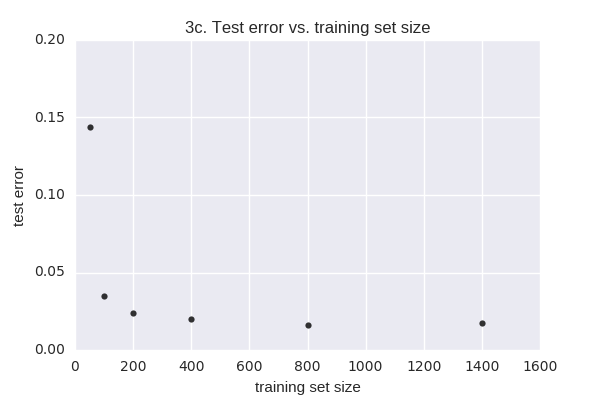

# **CS229 Autumn 2016 Problem Set #2**

### **1. Constructing kernels**

In class, we saw that by choosing a kernel $K(x,z) = \phi(x)^T \phi(z)$, we can implicitly map data to a high dimensional space, and have the SVM algorithm work in that space. One way to generate kernels is to explicitly define the mapping $\phi$ to a higher dimensional space, and then work out the corresponding $K$.

However, in this question we are interested in direct construction of kernels, I.e., suppose we have a function $K(x,z)$ that we think gives an appropriate similarity measure for our learning problem, and we are considering plugging $K$ into the SVM as the kernel function. However, for $K(x,z)$ to be a valid kernel, it must correspond to an inner product in some higher dimensional space resulting from some feature mapping $\phi$. Mercer's theorem tells us that $K(x,z)$ is a (Mercer) kernel iff for any finite set $\left\{x^{(1)}, \dots, x^{(m)} \right\}$, the matrix $K$ is symmetric and positive semidefinite, where the square matrix $K \in \mathbb{R}^{m \times m}$ is given by $K_{ij} = K\left(x^{(i)}, x^{(j)} \right)$.

Now the question: Let $K_1, K_2$ be kernels over $\mathbb{R}^n \times \mathbb{R}^n$, let $a \in \mathbb{R}^+$ be a positive real number, let $f: \mathbb{R}^n \mapsto \mathbb{R}$, let $\phi: \mathbb{R}^n \rightarrow \mathbb{R}^d$, let $K_3$ be a kernel over $\mathbb{R}^d \times \mathbb{R}^d$, and let $p(x)$ be a polynomial over $x$ with *positive* coefficients.

For each of the functions $K$ below, state whether it is necessarily a kernel. If you think it is, prove it; if you think it isn't, give a counter-example.

[Hint: For part (e), the answer is that $K$ *is* indeed a kernel. You still have to prove it, though. (This one may be harder than the rest.) The result may also be useful for another part of the problem.]

**(a)** $K(x,z) = K_1(x,z) + K_2(x,z)$

The kernel matrix corresponding to $K(x,z)$ is symmetric since it is the sum of the two valid kernel matrices (i.e. symmetric matrices) $K_1$ and $K_2$. Therefore, $K(x,z)$ is PSD and therefore a valid kernel if $\forall \hspace{.2em}z, z^TKz \geq 0$:
$$
\begin{aligned}
& \qquad z^TKz \\
& = z^T \left(K_1 + K_2 \right)z \\
& = z^TK_1z + z^TK_2z && \text{matrix mult. distributive over addition} \\
& \geq 0  && z^TK_1z \geq 0, \quad z^TK_2z \geq 0 \text{ since they are valid kernels} \\
& \therefore K \text{ is a valid kernel}
\end{aligned}
$$

**(b)** $K(x,z) = K_1(x,z) - K_2(x,z)$:

Similar to 1a, $K(x,z)$ is symmetric since it is the difference of two symmetric matrices.
$$
\begin{aligned}
& \qquad z^TKz \\
& = z^T \left(K_1 - K_2 \right) z \\
& = z^T K_1z - z^TK_2z &\text{matrix mult. distributive over addition} \\
& \geq 0 \quad \text{only if } z^TK_1z > z^TK_2z \\
& \therefore K \text{ is not a valid kernel}
\end{aligned}
$$

**(c)** $K(x,z) = aK_1(x,z)$

$K(x,z)$ is symmetric because it is a symmetric matrix $K_1$ scaled by a scalar $a$.

$$
\begin{aligned}
& \qquad z^TKz \\
& = z^T\left(aK_1 \right)z \\
& = az^TK_1z \\
& \geq 0 & a \in \mathbb{R}^+,\quad z^TK_1z \geq 0 \hspace{.5em}\forall z \\
& \therefore K \text{ is a valid kernel}
\end{aligned}
$$

**(d)** $K(x,z) = -aK_1(x,z)$

By the same logic as 1c, $K$ is not a valid kernel.

**(e)** $K(x,z) = K_1(x,z)K_2(x,z)$

$K(x,z)$ is symmetric since scalar multiplication is commutative.

$$
\begin{aligned}
        &&& K_1 \text{ is a kernel, so } \exists \hspace{.3em} \phi^{(1)} \text{ such that } K_1(x,z) = \left(\phi^{(1)}(x)\right)^T \left(\phi^{(1)}(z) \right)\\
K(x,z)  & = K_1(x,z) K_2 (x,z) && K_2 \text{ is a kernel, so } \exists \hspace{.3em} \phi^{(2)} \text{ such that } K_2(x,z) = \left(\phi^{(2)}(x)\right)^T \left(\phi^{(2)}(z) \right) \\
        & = \sum_i \phi_i^{(1)}(x) \phi_i^{(1)}(z) \sum_j \phi_j^{(2)} (x) \phi_j^{(2)}(z) \\
        & = \sum_i \sum_j \phi_i^{(1)}(x) \phi_i^{(1)}(z) \phi_j^{(2)} (x) \phi_j^{(2)}(z) \\
        & = \sum_i \sum_j \left[\phi_i^{(1)}(x) \phi_j^{(2)}(x) \right] \left[\phi_i^{(1)}(z) \phi_j^{(2)}(z) \right] && \text{def } \psi (\cdot) = \phi^{(1)}(\cdot) \phi^{(2)} (\cdot) \\
        & = \sum_{(i,j)} \psi_{i,j}(x) \psi_{i,j}(z) \\
K(x,z)  & = \psi(x)^T \psi(z), \quad \therefore K \text{ is a valid kernel}.
\end{aligned}
$$

**(f)** $K(x,z) = f(x)f(z)$

$K(x,z)$ is symmetric since scalar multiplication is commutative.

Let $f(x) = \psi(x)$ as in 1e., then $K$ is a valid kernel.

**(g)** $K(x,z) = K_3(\phi(x), \phi(z))$

$K_3$ is a valid kernel for any finite set $\left\{x^{(1)}, \dots, x^{(m)} \right\}$. This includes the set $\left\{\phi\left(x^{(1)} \right), \dots, \phi \left(x^{(m)} \right) \right\}$, so K is also a valid kernel.

**(h)** $K(x,z) = p(K_1(x,z))$

Combining the results from 1a (sum), 1c (scalar product), 1e (powers), and 1f (constant term), any polynomial of a kernel $K_1$ will also be a kernel.

### **2. Kernelizing the Perceptron**

Let there be a binary classification problem with $y \in \left\{-1,1 \right\}$. The perceptron uses hypotheses of the form $h_\theta(x) = g \left(\theta^T x\right)$, where $g(z) = \text{sign}(z) = 1$ if $z \geq 0, -1$ otherwise.

In this problem we will consider a stochastic gradient descent-like implementation of the perceptron algorithm where each update to the parameters $\theta$ is made by using only one training example. However, unlike stochastic gradient descent, the perceptron algorithm will only make one pass through the entire training set. The update rule for this version of the perceptron algorithm is given by

$$
\theta^{(i+1)} := \begin{cases}
                  \theta^{(i)} + \alpha y^{(i+1)}x^{(i+1)} & \text{if } h_{\theta^{(i)}}\left(x^{(i+1)}\right) y^{(i+1)} < 0 \\
                  \theta^{(i)} & \text{otherwise,}
                  \end{cases}
$$
where $\theta^{(i)}$ is the value of the parameters after the algorithm has seen the first $i$ training examples. Prior to seeing any training examples, $\theta^{(0)}$ is initialized to $\vec{0}$.

Let $K$ be a Mercer kernel corresponding to some very high-dimensional feature mapping $\phi$. Suppose $\phi$ is so high-dimensional (say $\infty$-dimensional) that it's infeasible to ever represent $\phi(x)$ explicitly. Describe how you would apply the "kernel trick" to the perceptron to make it work in the high-dimensional feature space $\phi$, but without ever explicitly computing $\phi(x)$. [Note: You don't have to worry about the intercept term. If you like, think of $\phi$ as having the property that $\phi_0(x)=1$ so that this is taken care of.] Your description should specify

**(a)** How you will (implicitly) represent the high-dimensional parameter vector $\theta^{(i)}$, including how the initial value $\theta^{(0)} = \vec{0}$ is represented (note that $\theta^{(i)}$ is now a vector whose dimension is the same as the feature vectors $\phi(x)$);

Since $\alpha$ is used to represent the learning rate, use $\beta$ to represent the coefficients in the representer theorem:

$$
\begin{aligned}
  \theta^{(i)}  & = \sum_{\ell=1}^i \beta_\ell \phi \left(x^{(\ell)} \right) && \text{representer theorem; substitute }\phi(x) \text{ for }x \\
                & && \phi \left(x^{(\ell)} \right)\text{ cannot be calculated explicitly,} \\
                & && \text{but it doesn't need to be, as seen below} \\
  \text{initial value } \theta^{(0)} & \text{ is the empty sum above}
\end{aligned}
$$

**(b)** How you will efficiently make a prediction on a new input $x^{(i+1)}$. I.e., how you will compute $h_{\theta^{(i)}} \left(x^{(i+1)} \right) = g \left(\theta^{(i)T} \phi \left(x^{(i+1)} \right) \right)$, using your representation of $\theta^{(i)}$; and

$$
\begin{aligned}
h_{\theta^{(i)}} \left(x^{(i+1)} \right)  & = g \left( \theta^{(i)T} \phi \left(x^{(i+1)} \right)\right) \\
                                          & = g \left( \sum_{\ell=1}^i \beta_\ell \phi \left(x^{(\ell)} \right)^T \phi \left(x^{(i+1)} \right)\right) \\
                                          & = g \left( \sum_{\ell=1}^i \beta_\ell K \left(x^{(\ell)}, x^{(i+1)} \right)  \right)
\end{aligned}
$$

**(c)** How you will modify the update rule given above to perform an update to $\theta$ on a new training example $\left(x^{(i+1)}, y^{(i+1)} \right)$; i.e., using the update rule corresponding to the feature mapping $\phi$:

$$
\theta^{(i+1)} := \theta^{(i)} + \alpha \mathbf{1} \left\{\theta^{(i)T}\phi \left(x^{(i+1)} \right)y^{(i+1)} < 0 \right\} y^{(i+1)} \phi \left(x^{(i+1)} \right)
$$
[Hint: our discussion of the representer theorem may be useful.]

$$
\begin{aligned}
\theta^{(i+1)}  & = \sum_{\ell=1}^{i+1} \beta_\ell \phi \left(x^{(\ell)} \right) && \text{from part a} \\
                & = \theta^{(i)} + \beta_{i+1} \phi \left(x^{(i+1)} \right) && \text{the update is the previous } \theta \\
                &&& \text{plus the next training example weighted by } \beta_{(i+1)} \\
                & = \theta^{(i)} + \alpha \left(y^{(i)} - h_{\theta^{(i)}} \left(\phi \left(x^{(i+1)} \right) \right) \right) \phi \left(x^{(i)} \right) && \text{perceptron update rule? } h_{\theta^{(i)}} \text{ is calculated as in part b}
\end{aligned}
$$

Update rule:
$$
\begin{aligned}
\theta \gets \theta + \alpha \left(y^{(i)}- h_\theta \left(\phi \left(x^{(i)} \right) \right) \right) \phi\left(x^{(i)} \right)
\end{aligned}
$$

### **3. Spam classification**

In this problem, we will use the naive Bayes algorithm and an SVM to build a spam classifier.

In recent years, spam on electronic newsgroups has been an increasing problem. Here, we'll build a classifier to distinguish between "real" newsgroup messages, and spam messages. For this experiment, we obtained a set of spam emails, and a set of genuine newsgroup messages. Using only the subject line and body of each message, we'll learn to distinguish between the spam and the non-spam.

In order to get the text emails into a form usable by naive Bayes, we've already done some preprocessing on the messages. You can look at two sample spam emails in the files `spam_sample_original*`, and their preprocessed forms in the files `spam_sample_preprocessed*`. The first line in the preprocessed format is just the label and is not part of the message. The preprocessing ensures that only the message body and subject remain in the dataset; email addresses (EMAILADDR), web addresses (HTTPADDR), currency (DOLLAR), and numbers (NUMBER) were also replaced by the special tokens to allow them to be considered properly in the classification process. (In this problem, we'll call the features "tokens" rather than "words", since some of the features will correspond to special values like EMAILADDR. You don't have to worry about the distinction.) The files `news_sample_original` and `news_sample_preprocessed` also give an example of a non-spam mail.

The work to extract feature vectors out of the documents has also been done for you, so you can just load in the design matrices (called document-word matrices in text classification) containing all the data. In a document-word matrix, the $i$-th row represents the $i$-th document/email, and the $j$-th column represents the $j$-th distinct token. This, the $(i,j)$-entry of this matrix represents the numbers of occurrences of the $j$th token in the $i$th document.

For this problem, we've chosen as our set of tokens considered (i.e., as our vocabulary) only the medium frequency tokens. The intuition is that tokens that occur too often or too rarely do not have much classification value. (Example tokens that occur very often are words like "the", "and", and "of", which occur in so many emails and are sufficiently content-free that they aren't worth modeling.) Also, words were stemmed using a standard stemming algorithm; basically, this means that "price", "prices", and "priced" have all been replaed with "price", so that they can be treated as the same word. For a list of the tokens used, see the file `TOKENS_LIST`.

Since the document-word matrix is extremely sparse (has lots of zero entries), we have stored it in our own efficient format to save space. You don't have to worry about this format. The file `readMatrix.m` provides the `readMatrix` function that reads in the document-word matrix and the correct class labels for the various docuemnts. Code in `nb_train.m` and `nb_test.m` shows how `readMatrix` should be called. The documentation at the top of these two fields will tell you all you need to know about the setup.

**(a)** Implement a naive Bayes classifier for spam classification, using the multinomial event model and Laplace smoothing.

You should use the code outline provided in `nb_train.m` to train your parameters,
and then use these parameters to classify the test set data by filling in the code in `nb_test.m`. You may assume that any parameters computed in nb train.m are in memory when nb test.m is executed, and do not need to be recomputed (i.e., that
`nb_test.m` is executed immediately after `nb_train.m`).

Train your parameters using the document-word matrix in `MATRIX.TRAIN`, and then report the test set error on `MATRIX.TEST`.

**Remark.** If you implement naive Bayes the straightforward way, you’ll find that the computed $p(x \mid y) = \prod_i p(x_i \mid y)$ often equals zero. This is because $p(x_i \mid y)$, which is the product of many numbers less than one, is a very small number. The standard computer representation of real numbers cannot handle numbers that are too small, and instead rounds them off to zero. (This is called "underflow.") You’ll have to find a way to compute naive Bayes’ predicted class labels without explicitly representing very small numbers such as $p(x_i \mid y)$. [Hint: Think about using logarithms.]

Test set error = 1.625%. See python notebook `ps2-3.ipynb`.

**(b)** Intuitively, some tokens may be particularly indicative of an email being in a particular class. We can try to get an informal sense of how indicative token $i$ is for the SPAM class by looking at:

$$
\log \frac{p\left(x_j=i \mid y = 1 \right)}{p\left(x_j=i \mid y = 0 \right)} = \log \left(\frac{P\left(\text{token } i \mid \text{email is SPAM}\right)}{P\left(\text{token } i \mid \text{email is NOTSPAM} \right)} \right).
$$
Using the parameters fit in part (a), find the 5 tokens that are most indicative of the SPAM class (i.e., have the highest positive value on the measure above). The numbered list of tokens in the file `TOKENS_LIST` should be useful for identifying the words/tokens.

Top 5 predictive tokens: 'httpaddr', 'spam', 'unsubscrib', 'ebai', 'valet'. See python notebook `ps2-3.ipynb`.

**(c)** Repeat part (a), but with training sets of size ranging from 50, 100, 200, ... , up to 1400, by using the files `MATRIX.TRAIN.*`. Plot the test error each time (use `MATRIX.TEST` as the test data) to obtain a learning curve (test set error vs. training set size). You may need to change the call to `readMatrix` in `nb_train.m` to read the correct file each time. Which training-set size gives the best test set error?

The lowest test set error is observed for the largest training set (1400 examples). See python notebook `ps2-3.ipynb`.

**(d)** Train an SVM on this dataset using stochastic gradient descent and the radial basis function (also known as the Gaussian) kernel, which sets
$$
K(x,z) = \exp\left(- \frac{1}{2 \tau^2} \lVert x-z \rVert_2^2 \right).
$$
In this case, recall that (as proved in class) the objective with kernel matrix $K= \left[K^{(1)} \cdots K^{(m)} \right] \in \mathbb{R}^{m \times m}$ is given by

$$
J(\alpha) = \frac{1}{m} \sum_{i=1}^m \left[1-y^{(i)} K^{(i)T} \alpha \right]_{+} + \frac{\lambda}{2} \alpha^T K \alpha
$$
where $\left[t \right]_+ = \max \left\{t,0\right\}$ is the positive part function. In this case, the gradient (actually, this is known as the *subgradient*) of the individual loss terms is

$$
\nabla_\alpha \left[1-y^{(i)} K^{(i)} \alpha \right]_+ =  \begin{cases}  -y^{(i)} K^{(i)} & \text{if } y^{(i)}K^{(i)T}\alpha < 1 \\
                                                                        0 &\text{otherwise.}
                                                          \end{cases}
$$
In your SVM training, you should perform stochastic gradient descent, where in each iteration you choose an index $i \in \{1, \dots, m \}$ uniformly at random, for a total of $40 \cdot m$ steps, where $m$ is the training set size, and your kernel should use $\tau = 8$ and regularization multiplier $\lambda = \frac{1}{64m}$. For this part of the problem, you shoudl also replace each training or test point $x^{(i)}$ with a zero-one vector $z^{(i)}$, where $z^{(i)} = 1$ if $x_j^{(i)} > 0$ and $z^{(i)} = 0$ if $x^{(i)} = 0$. Initialize your SGD procedure at $\alpha = 0$.

The output of your training code, which you should implement in `svm_test.m`, should be the $\alpha$ vector that is the *average* of all the $\alpha$ vectors that your iteration updates. At iteration $t$ of stochastic gradient descent you should use stepsize $1/\sqrt{t}$.

**(e)** How do naive Bayes and Support Vector Machines compare (in terms of generalization error) as a function of the training set size?

### **4. Properties of the VC dimension**

In this problem, we investigate a few properties of the Vapnik-Chervonenkis dimension, mostly relating to how $\text{VC}(H)$ increases as the set $H$ increases. For each part of this problem, you should state whether the given statement is true, and justify your answer with either a formal proof or a counter-example.

**(a)** Let two hypothesis classes $H_1$ and $H_2$ satisfy $H_1 \subseteq H_2$. Prove or disprove: $\text{VC}\left(H_1 \right) \leq \text{VC}\left(H_2 \right)$.

True.

  - Let $\text{VC} \left(H_1 \right) = d$.
      - I.e., $H_1$ can shatter a set of $d$ points.
  - Since $H_1$ is contained within $H_2$, $H_2$ also shatters $d$.
  - Therefore, $\text{VC}\left(H_1 \right) \leq \text{VC}\left(H_2 \right)$.

**(b)** Let $H_1 = H_2 \cup \left\{h_1, \dots, h_k \right\}$. (I.e., $H_1$ is the union of $H_2$ and some set of $k$ additional hypotheses.) Prove or disprove: $\text{VC}\left(H_1\right) \leq \text{VC} \left(H_2 \right) + k$. [Hint: You might want to start by considering the case of $k=1$.]

True.

  - Consider the case of $k=1$, i.e. $H_1 = H_2 \cup \left\{h_1 \right\}$.
      - Let $\text{VC}\left(H_1 \right) = d$
          - then, there exists a set $S_1$ such that $H_1$ realizes the correct labeling of every point in $S_1$
      - Pick an arbitrary ($x \in S_1$).
          - $H_1$ shatters $S_1$, so there must be a hypothesis $h^\prime$ which agrees with $h_1$ on labelings for all points in $S_1$ *except* $x$.
      - Define $H^\prime: H_1 \backslash \{h_1\}$.
          - $H^\prime$ achieves all possible labelings on $S^\prime \equiv S_1 \backslash \{x\}$, i.e. $H^\prime$ shatters $S^\prime$
      - then,

      $$
      \begin{aligned}
      \text{VC}\left(H^\prime \right) & \geq \left\lvert S^\prime \right\rvert && \text{since } H^\prime \text{ shatters the set } S^\prime, \text{VC}(H^\prime) \text{ is at least the size of } S^\prime  \\
      \text{VC}\left(H^\prime \right) & \geq d-1
      \end{aligned}
      $$

      $$
      \begin{aligned}
      H^\prime & \subseteq H_2 \\
      \text{VC}\left(H^\prime \right) & \leq \text{VC} \left(H_2 \right) && \text{from part a} \\
      d-1 & \leq \text{VC} \left(H_2 \right) &&\text{VC}\left(H^\prime \right) \geq d-1\\
      \text{VC}\left(H_1 \right) - 1 & \leq \text{VC} \left(H_2 \right) && \text{VC}\left(H_1 \right) \equiv d \\
      \text{VC}\left(H_1 \right) & \leq \text{VC}\left(H_2 \right) + 1
      \end{aligned}
      $$

(At first I thought the answer was obviously false, until I understood the difference between a hypothesis and a hypothesis class. A single hypothesis can't shatter a set, since it only realizes one set of labels on the set. I didn't get this until after I looked at the solutions, so this answer is pretty much from the solutions.)

**(c)** Let $H_1 = H_2 \cup H_3$. Prove or disprove: $\text{VC} \left(H_1 \right) \leq \text{VC} \left(H_2 \right) + \text{VC} \left(H_3 \right)$.

False.

  - from part b, we have $\text{VC}\left(H_1 \right) \leq \text{VC} \left(H_2 \right) + \left\lvert H_3 \right\rvert$, where $\left\lvert H_3 \right\rvert$ is the number of hypotheses in $H_3$.
      - $\text{VC}\left(H_3 \right) \leq \left\lvert H_3 \right\rvert$, since a hypothesis class cannot shatter a set larger than the number of hypotheses in the hypothesis class
      - if $\text{VC}\left(H_3 \right) = k$, then the statement is true
      - however, if $\text{VC}\left(H_3 \right) < k$, then the statement is not necessarily true

### **5. Training and testing on different distributions**

In the discussion in class about learning theory, a key assumption was that we trained and tested our learning algorithms on the same distribution $\mathcal{D}$. In this problem, we'll investigate one special case of training and testing on different distributions. Specifically, we will consider what happens when the training examples are *noisy*, but the test labels are not.

Consider a binary classification problem with labels $y \in \left\{0,1 \right\}$, and let $\mathcal{D}$ be a distribution over $(x,y)$, that we'll think of as the original, "clean" or "uncorrupted" distribution. Define $\mathcal{D}_\tau$ to be a "corrupted" distribution over $(x,y)$ which is the same as $\mathcal{D}$, except that the labels $y$ have some probability $0 \leq \tau < 0.5$ of being flipped. Thus, to sample from $\mathcal{D}_\tau$, we would first sample $(x,y)$ from $\mathcal{D}$, and then with probability $\mathcal{T}$ (independently of the observed $x$ and $y$) replace $y$ with $1-y$. Note that $\mathcal{D}_0 = \mathcal{D}$.

We define the generalization error *with respect to* $\mathcal{D}_{\mathcal{T}}$ to be

$$
\varepsilon_{\tau}(h) = P_{(x,y) \sim \mathcal{D}_\tau} \left[h(x) \neq y \right].
$$

Note that $\varepsilon_0(h)$ is the generalization error with respect to the "clean" distribution; it is with respect to $\varepsilon_0$ that we wish to evaluate our hypotheses.

**(a)** For any hypothesis $h$, the quantity $\varepsilon_0(h)$ can be calculated as a function of $\varepsilon_\tau(h)$ and $\tau$. Write down a formula for $\varepsilon_0(h)$ in terms of $\varepsilon_\tau(h)$ and $\tau$, and justify your answer.

An error in the 'corrupted' distribution occurs if a classification error was made on the original distribution and the label was not inverted, or if classification was correct on the original distribution but the label was inverted. Therefore,

$$
\begin{aligned}
\varepsilon_\tau & = \left(\text{error on } \mathcal{D} \right) \left(\text{label not inverted} \right) + \left(  \text{no error on } \mathcal{D}\right) \left(\text{label inverted} \right) \\
\varepsilon_\tau & = \varepsilon_0 \left(1-\tau \right) + \left(1-\varepsilon_0 \right) \tau \\
\varepsilon_\tau & = \varepsilon_0 - \tau \varepsilon_0 + \tau - \tau \varepsilon_0 \\
\varepsilon_\tau & = \varepsilon_0 \left(1-2 \tau \right)  + \tau \\
\varepsilon_0 & = \frac{\varepsilon_\tau - \tau}{1 - 2\tau}
\end{aligned}
$$

**(b)** Let $\lvert H \rvert$ be finite, and suppose our training set $S = \left\{\left(x^{(i)}, y^{(i)} \right); i= 1, \dots, m \right\}$ is obtained by drawing $m$ examples IID from the corrupted distribution $\mathcal{D}_\tau$. Suppose we pick $h \in H$ using empirical risk minimization: $\hat{h} = \arg \min_{h \in H} \hat{\varepsilon}_S(h)$. Also, let $h^* = \arg \min_{h \in H} \varepsilon_0(h)$.

Let any $\delta, \gamma > 0$ be given. Prove that for

$$
\varepsilon_0 \left(\hat{h} \right) \leq \varepsilon_0(h^*) + 2 \gamma
$$

to hold with probability $1-\delta$, it suffices that

$$
m \geq \frac{1}{2(1-2\tau)^2 \gamma^2} \log \frac{2 \lvert H \rvert}{ \delta}.
$$

$$
\begin{aligned}
\varepsilon_0 \left(\hat{h} \right) & = \frac{\varepsilon_\tau \left(\hat{h} \right) - \tau}{1-2\tau} \\
                                    & \leq \frac{\hat{\varepsilon}_\tau \left(\hat{h} \right) + \bar{\gamma}- \tau}{1-2\tau} \hspace{1em}\text{ w.p. } \left(1-\delta \right) && \left\lvert \varepsilon_\tau \left(\hat{h} \right) - \hat{\varepsilon}_\tau\left(\hat{h} \right)\right\rvert \leq \bar{\gamma}   \text{ by Hoeffding ineq.}\\
                                    & \leq \frac{\hat{\varepsilon}_\tau \left(h^* \right) + \bar{\gamma}- \tau}{1-2\tau} \hspace{1em} \text{ w.p. } \left(1-\delta \right) && \hat{\varepsilon}_\tau \left(\hat{h} \right) \leq \hat{\varepsilon}_\tau \left(h^* \right), \text{ i.e. train err. } < \text{ generalization err.} \\
                                    & \leq \frac{\varepsilon_\tau \left(h^* \right) + 2 \bar{\gamma}- \tau}{1-2\tau} \hspace{1em} \text{ w.p. } \left(1-\delta \right) && \left\lvert \varepsilon_\tau \left(h^* \right) - \hat{\varepsilon}_\tau \left(h^* \right)\right\rvert \leq \bar{\gamma} \text{ by Hoeffding ineq.} \\
                                    & \leq \frac{\left(1-2\tau \right)\varepsilon_0 \left(h^* \right) + \tau + 2 \bar{\gamma}-\tau}{1-2\tau} \hspace{1em} \text{w.p. } \left(1-\delta \right) && \varepsilon_\tau\left(h^* \right) = \left(1-2\tau \right) \varepsilon_0 \left(h^* \right) + \tau \text{ (from part a)} \\
                                    & \leq \varepsilon_0 \left(h^* \right) + \frac{2 \bar{\gamma}}{1-2\tau} \hspace{1em} \text{w.p. } \left(1-\delta \right) \\
\varepsilon_0 \left(\hat{h} \right) & \leq \varepsilon_0 \left(h^* \right) + 2 \gamma \hspace{1em} \text{w.p. }\left(1-\delta \right) && \text{letting } \bar{\gamma} = \gamma\left(1-2\tau \right), \text{ where } \delta = 2\lvert H\rvert \exp \left(-2 \bar{\gamma}^2 m \right)
\end{aligned}
$$

$$
\begin{aligned}
\delta & = 2\lvert H\rvert \exp \left(-2 \bar{\gamma}^2 m \right) \\
\delta & = 2\lvert H\rvert \exp \left(-2 \left(\gamma \left(1-2\tau \right) \right)^2 m \right) && \bar{\gamma} = \gamma\left(1-2\tau \right) \\
\frac{\delta}{2\lvert H\rvert} & = \exp \left(-2 \left(\gamma \left(1-2\tau \right) \right)^2 m \right) \\
\log\frac{\delta}{2\lvert H\rvert} & = -2 \left(\gamma \left(1-2\tau \right) \right)^2 m \\
m & \geq \frac{1}{2  \left(1-2\tau \right)^2\gamma^2} \log \frac{2\lvert H\rvert}{\delta}
\end{aligned}
$$

**Remark.** This result suggests that, roughly, $m$ examples that have been corrupted at noise level $\tau$ are worth about as much as $(1-2\tau)^2m$ uncorrupted training examples. This is a useful rule-of-thumb to know if you ever need to decide whether/how much to pay for a more reliable source of training data. (If you've taken a class in information theory, you may also have heard that $\left(1-\mathcal{H}(\tau) \right) m$ is a good estimate of the information in the $m$ corrupted examples, where $\mathcal{H}(\tau) = -\left( \tau \log_2 \tau + \left(1-\tau \right) \log_2 \left(1-\tau \right) \right)$ is the "binary entropy" function. And indeed, the functions $(1-2\tau)^2$ and $1-\mathcal{H}(\tau)$ are quite close to each other.)

**(c)** Comment **briefly** on what happens as $\tau$ approaches $0.5$.

As $\tau \rightarrow 0.5$, the number of samples $m$ needed for the guarantee in part b goes to infinity. This makes sense since at $\tau=0.5$, the labels of the training data are assigned randomly.

### **6. Boosting and high energy physics**

In class, we discussed boosting algorithms and decision stumps. In this problem, we explore applications of these ideas to detect particle emissions in a high-energy particle accelerator. In high energy physics, such as at the Large Hadron Collider (LHC), one accelerates small particles to relativistic speeds and smashes them into one another, tracking the emitted particles. The goal in these problems is to detect the emission of certain interesting paticles based on other observed particles and energies. In this problem, we explore the application of boosting to a higher energy physics problem, where we use decision stumps applied to 18 low- and high-level physics-based features. All data for the problem is available at [http://cs229.stanford.edu/materials/boost_data.tgz](http://cs229.stanford.edu/materials/boost_data.tgz).

For the first part of the problem, we explore how decision stumps based on thresholding can provide a weak-learning guarantee. In particular, we show that for real-valued attributes $x$, thre is an edge $\gamma > 0$ that decision stumps guarantee. Recall that thresholding-based decision stumps are functions indexed by a threshold $s$ and sign $+/-$, such that

$$
\phi_{s,+}(x) = \begin{cases}
                1 & \text{if }x \geq s \\
                -1 & \text{if } x < s
                \end{cases}
                \hspace{1em}
                \text{and}
                \hspace{1em}
\phi_{s, -}(x) = \begin{cases}
                -1 & \text{if }x \geq s \\
                1 & \text{if } x < s
                \end{cases}
$$

That is, $\phi_{s, +}(x) = -\phi_{s, -}(x)$. We assume for simplicity in the theoretical parts of this exercise that our input attribute vectors $x \in \mathbb{R}$, that is, they are one-dimensional. Now, we would like to guarantee that there is some $\gamma > 0$ and a threshold $s$ such that, for *any* distribution $p$ on the training set $\left\{x^{(i)}, y^{(i)} \right\}_{i=1}^m$ (where $y^{(i)} \in \left\{-1, +1\right\}$ and $x^{(i)} \in \mathbb{R}$, and we recall that $p$ is a distribution on the training set if $\sum_{i=1}^m p_i = 1$ and $p_i \geq 0$ for each $i$) we have

$$
\sum_{i=1}^m p_i \mathbf{1} \left\{y^{(i)} \neq \phi_{s, +} \left(x^{(i)} \right) \right\} \leq \frac{1}{2} - \gamma \hspace{1em} \text{or} \hspace{1em} \sum_{i=1}^m p_i \mathbf{1} \left\{y^{(i)} \neq \phi_{s, -}\left(x^{(i)} \right) \right\} \leq \frac{1}{2} - \gamma
$$

For simplicity, we assume that all of the $x^{(i)}$ are *distinct*, so that none of them are equal. We also assume (without loss of generality, but this makes the problem notationally simpler) that

$$
x^{(1)} > x^{(2)} > \cdots > x^{(m)}.
$$

**(a)** Show that for each threshold $s$, there is some $m_0(s) \in \left\{0, 1, \dots, m \right\}$ such that

$$
\sum_{i=1}^m p_i \mathbf{1} \left\{\phi_{s, +} \left(x^{(i)} \right) \right\} = \frac{1}{2} - \frac{1}{2} \left(\sum_{i=1}^{m_0(s)} y^{(i)} p_i - \sum_{i=m_0(s)+1}^m y^{(i)}p_i \right)
$$
and

$$
\sum_{i=1}^m p_i \mathbf{1} \left\{\phi_{s, -} \left(x^{(i)} \right) \right\} = \frac{1}{2} - \frac{1}{2} \left(\sum_{i=m_0(s)+1}^m y^{(i)}p_i - \sum_{i=1}^{m_0(s)} y^{(i)} p_i  \right)
$$

Treat sums over empty sets of indices as zero, so that $\sum_{i=1}^0 a_i = 0$ for any $a_i$, and similarly $\sum_{i = m+1}^m a_i = 0$.

**(b)** Define, for each $m_0 \in \left\{ 0, 1, \dots, m \right\}$,

$$
f\left(m_0\right) = \sum_{i=1}^{m_0} y^{(i)}p_i - \sum_{i=m_0+1}^m y^{(i)}p_i.
$$
Show that there exists *some* $\gamma > 0$, which may depend on the training set size $m$ (but should not depend on $p$), such that for any set of probabilities $p$ on the training set, where $p_i \geq 0$ and $\sum_{i=1}^m p_i = 1$, we can find $m_0$ with

$$
\left\lvert f\left(m_0\right) \right\rvert \geq 2 \gamma.
$$
What is your $\gamma$?

(*Hint:* Consider the difference $f(m_0) - f(m_0 + 1)$.)

**(c)** Based on your answer to part (6b), what edge can thresholded decision stumps guarantee on any training set $\left\{x^{(i)}, y^{(i)} \right\}_{i=1}^m$, where the raw attributes $x^{(i)} \in \mathbb{R}$ are all distinct? Recall that the edge of a weak classifier $\phi: \mathbb{R} \rightarrow \left\{-1, 1 \right\}$ is the constant $\gamma \in \left[0, \frac{1}{2} \right]$ such that

$$
\sum_{i=1}^m p_i \mathbf{1} \left\{\phi \left(x^{(i)} \right) \neq y^{(i)} \right\} \leq \frac{1}{2} - \gamma.
$$

Can you give an upper bound on the number of thresholded deicision stumps required to achieve zero error on a given training set?

**(d)**
